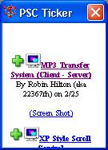



## PSC Ticker Control

### Description

This PSC Code Ticker is an ActiveX control. You can modify which PSC World's ticker it displays, such as Visual Basic, .Net, Java/JavaScript, etc. I have also included a sample project for those who can't live without them.
 
### More Info
 
Instructions (also included):

----

1. Compile the prjTicker project.

2. Check out the example (you may need to redefine the of the ocx file) or make a new project and insert the into it.

             |
---                |---
**Submitted On**   |2006-02-25 15:42:02
**By**             |[Matt DeKok](https://github.com/Planet-Source-Code/PSCIndex/blob/master/ByAuthor/matt-dekok.md)
**Level**          |Beginner
**User Rating**    |4.3 (13 globes from 3 users)
**Compatibility**  |VB 6\.0
**Category**       |[OLE/ COM/ DCOM/ Active\-X](https://github.com/Planet-Source-Code/PSCIndex/blob/master/ByCategory/ole-com-dcom-active-x__1-29.md)
**World**          |[Visual Basic](https://github.com/Planet-Source-Code/PSCIndex/blob/master/ByWorld/visual-basic.md)
**Archive File**   |[PSC\_Ticker1976252252006\.zip](https://github.com/Planet-Source-Code/matt-dekok-psc-ticker-control__1-64454/archive/master.zip)

